# Architecture Documentation

## System Architecture

This document provides detailed architecture diagrams for the Banking Data Warehouse project.

## Data Flow Architecture


## Medallion Architecture Layers

```mermaid
graph LR
    subgraph Bronze["🥉 Bronze Layer (Raw)"]
        B1[S3 CSV Files]
        B2[Glue Catalog]
        B3[External Tables]
    end
    
    subgraph Silver["🥈 Silver Layer (Staging)"]
        S1[stg_dim_customer]
        S2[stg_dim_account]
        S3[stg_fact_transaction]
        S4[stg_fact_investment]
    end
    
    subgraph Gold["🥇 Gold Layer (Business)"]
        G1[dim_customer]
        G2[dim_account]
        G3[fact_transaction]
        G4[fact_investment]
    end
    
    Bronze --> Silver
    Silver --> Gold
    
    style Bronze fill:#cd7f32,color:#fff
    style Silver fill:#c0c0c0,color:#000
    style Gold fill:#ffd700,color:#000
```



## Star Schema - Dimensional Model

### Complete Entity Relationship Diagram


### Detailed Schema Definition

```mermaid
erDiagram
    %% Central Fact Tables
    FACT_TRANSACTIONS ||--o{ DIM_CUSTOMER : "FK1"
    FACT_TRANSACTIONS ||--o{ DIM_DATE : "FK2"
    FACT_TRANSACTIONS ||--o{ DIM_CHANNEL : "FK3"
    FACT_TRANSACTIONS ||--o{ DIM_ACCOUNT : "FK4"
    FACT_TRANSACTIONS ||--o{ DIM_TRANSACTION_TYPE : "FK5"
    FACT_TRANSACTIONS ||--o{ DIM_LOCATION : "FK6"
    FACT_TRANSACTIONS ||--o{ DIM_CURRENCY : "FK7"
    FACT_TRANSACTIONS ||--o{ DIM_LOAN : "FK8"
    
    FACT_DAILY_BALANCES ||--o{ DIM_DATE : "FK1"
    FACT_DAILY_BALANCES ||--o{ DIM_ACCOUNT : "FK2"
    
    FACT_CUSTOMER_INTERACTION ||--o{ DIM_DATE : "FK1"
    FACT_CUSTOMER_INTERACTION ||--o{ DIM_ACCOUNT : "FK2"
    FACT_CUSTOMER_INTERACTION ||--o{ DIM_CHANNEL : "FK3"
    
    FACT_LOAN_PAYMENT ||--o{ DIM_DATE : "FK1"
    FACT_LOAN_PAYMENT ||--o{ DIM_LOAN : "FK2"
    FACT_LOAN_PAYMENT ||--o{ DIM_CUSTOMER : "FK3"
    
    FACT_INVESTMENT ||--o{ DIM_DATE : "FK1"
    FACT_INVESTMENT ||--o{ DIM_INVESTMENT_TYPE : "FK2"
    FACT_INVESTMENT ||--o{ DIM_ACCOUNT : "FK3"
    
    %% Dimension Relationships
    DIM_ACCOUNT ||--o{ DIM_CUSTOMER : "customer_id"
    
    %% DIMENSION: Customer
    DIM_CUSTOMER {
        int customer_id PK "Primary Key"
        varchar first_name "Customer first name (50)"
        varchar last_name "Customer last name (50)"
        varchar email "Email address (30)"
        varchar address "Street address (255)"
        varchar city "City (50)"
        varchar state "State (50)"
        varchar postal_code "Postal code (10)"
        varchar phone_number "Phone number (50)"
    }
    
    %% DIMENSION: Date
    DIM_DATE {
        int date_id PK "Primary Key"
        date date_date "Calendar date"
        int day "Day of month"
        int month "Month number"
        int year "Year"
        int quarter "Quarter (calculated)"
        varchar weekday "Day of week (15)"
    }
    
    %% DIMENSION: Account
    DIM_ACCOUNT {
        int account_id PK "Primary Key"
        varchar account_number "Account number (20)"
        int customer_id FK "Foreign Key to DimCustomer"
        varchar account_type "Account type (50)"
        decimal account_balance "Current balance (18,2)"
        int credit_score "Credit score"
    }
    
    %% DIMENSION: Channel
    DIM_CHANNEL {
        int channel_id PK "Primary Key"
        varchar channel_name "Channel name (255)"
        varchar weekday "Operating days (15)"
    }
    
    %% DIMENSION: Transaction Type
    DIM_TRANSACTION_TYPE {
        int transaction_type_id PK "Primary Key"
        varchar description "Transaction type description (255)"
    }
    
    %% DIMENSION: Location
    DIM_LOCATION {
        int location_id PK "Primary Key"
        varchar address_id "Location address (255)"
        varchar city "City (50)"
        varchar state "State (50)"
        varchar country "Country (50)"
    }
    
    %% DIMENSION: Currency
    DIM_CURRENCY {
        int currency_id PK "Primary Key"
        varchar name "Currency name (255)"
        varchar iso_code "ISO currency code (3)"
        boolean active "Active status"
    }
    
    %% DIMENSION: Loan
    DIM_LOAN {
        int loan_id PK "Primary Key"
        varchar loan_type "Loan type (50)"
        decimal loan_amount "Loan amount (18,2)"
        decimal interest_rate "Interest rate (18,2)"
    }
    
    %% DIMENSION: Investment Type
    DIM_INVESTMENT_TYPE {
        int investment_type_id PK "Primary Key"
        varchar investment_type_name "Investment type name (255)"
    }
    
    %% FACT: Transactions
    FACT_TRANSACTIONS {
        int customer_id PK_FK1 "Composite PK + FK"
        int customer_id FK1 "FK to DimCustomer"
        date txn_date FK2 "FK to DimDate"
        int channel_id FK3 "FK to DimChannel"
        int account_id FK4 "FK to DimAccount"
        int txn_type_id FK5 "FK to DimTransactionType"
        int location_id FK6 "FK to DimLocation"
        int currency_id FK7 "FK to DimCurrency"
        int loan_id FK8 "FK to DimLoan (nullable)"
        int investment_type_id FK9 "FK to DimInvestmentType (nullable)"
        decimal txn_amount "Transaction amount (18,2)"
        varchar txn_status "Transaction status (15)"
    }
    
    %% FACT: Daily Balances
    FACT_DAILY_BALANCES {
        int balances_id PK "Primary Key"
        int date_id FK1 "FK to DimDate"
        int account_id FK2 "FK to DimAccount"
        decimal opening_balance "Opening balance (18,2)"
        decimal closing_balance "Closing balance (18,2)"
        decimal average_balance "Average balance (18,2)"
    }
    
    %% FACT: Customer Interactions
    FACT_CUSTOMER_INTERACTION {
        int interaction_id PK "Primary Key"
        int date_id FK1 "FK to DimDate"
        int account_id FK2 "FK to DimAccount"
        int channel_id FK3 "FK to DimChannel"
        varchar interaction_type "Interaction type (50)"
        int interaction_rating "Customer rating"
    }
    
    %% FACT: Loan Payments
    FACT_LOAN_PAYMENT {
        int payment_id PK "Primary Key"
        int date_id FK1 "FK to DimDate"
        int loan_id FK2 "FK to DimLoan"
        int customer_id FK3 "FK to DimCustomer"
        decimal payment_amount "Payment amount (18,2)"
        varchar payment_status "Payment status (50)"
    }
    
    %% FACT: Investments
    FACT_INVESTMENT {
        int investment_id PK "Primary Key"
        int date_id FK1 "FK to DimDate"
        int investment_type_id FK2 "FK to DimInvestmentType"
        int account_id FK3 "FK to DimAccount"
        decimal amount_invested "Amount invested (18,2)"
        decimal investment_return "Investment return (20)"
    }
```

### Schema Statistics

| Table Type | Count | Total Columns |
|------------|-------|---------------|
| **Fact Tables** | 5 | 45 |
| **Dimension Tables** | 9 | 47 |
| **Total Tables** | 14 | 92 |

### Fact Table Details

| Fact Table | Grain | Dimensions | Measures |
|------------|-------|------------|----------|
| **FactTransactions** | One row per transaction | 8+ dimensions | transaction_amount, txn_status |
| **FactDailyBalances** | One row per account per day | 2 dimensions | opening_balance, closing_balance, average_balance |
| **FactCustomerInteraction** | One row per interaction | 3 dimensions | interaction_type, interaction_rating |
| **FactLoanPayment** | One row per loan payment | 3 dimensions | payment_amount, payment_status |
| **FactInvestment** | One row per investment | 3 dimensions | amount_invested, investment_return |

---

## Constellation Schema Architecture

This project implements a **Constellation Schema** (also called Galaxy Schema), which extends the traditional star schema by having multiple fact tables sharing common dimension tables.

### Why Constellation Schema?

**Advantages:**
1. ✅ **Reduces Redundancy** - Shared dimensions (Date, Customer, Account) across multiple business processes
2. ✅ **Analytical Flexibility** - Enables cross-process analysis (e.g., "How do transactions relate to investments?")
3. ✅ **Scalability** - Easy to add new fact tables without duplicating dimensions
4. ✅ **Conformed Dimensions** - Ensures consistency across business processes

### Shared vs. Specific Dimensions

```
┌─────────────────────────────────────────────────────────────┐
│                    SHARED DIMENSIONS                        │
│  (Used by multiple fact tables)                             │
│                                                             │
│  • DimDate         - All facts are time-dependent          │
│  • DimCustomer     - Customer identity across all processes│
│  • DimAccount      - Account bridge between customer/facts │
│  • DimLocation     - Geographic information                │
│  • DimCurrency     - Currency codes for amounts            │
│  • DimChannel      - Interaction/transaction channels      │
└─────────────────────────────────────────────────────────────┘

┌─────────────────────────────────────────────────────────────┐
│                   SPECIFIC DIMENSIONS                       │
│  (Used by specific fact tables)                             │
│                                                             │
│  • DimTransactionType  - Only for FactTransactions         │
│  • DimInvestmentType   - Only for FactInvestment           │
│  • DimLoan            - Used by FactTransactions &         │
│                         FactLoanPayment                     │
└─────────────────────────────────────────────────────────────┘
```

### Data Model Features

#### 1. **Conformed Dimensions**
DimDate, DimCustomer, and DimAccount are **conformed dimensions** - they have the same meaning and content across all fact tables, enabling drill-across queries.

**Example Query:**
```sql
-- Analyze transactions and investments for the same customers in the same time period
SELECT 
    c.customer_id,
    c.full_name,
    d.year_month,
    SUM(ft.transaction_amount) AS total_transactions,
    SUM(fi.amount_invested) AS total_investments
FROM gold.dim_customer c
JOIN gold.dim_account a ON c.customer_id = a.customer_id
LEFT JOIN gold.fact_transaction ft ON a.account_id = ft.account_id
LEFT JOIN gold.fact_investment fi ON a.account_id = fi.account_id
JOIN gold.dim_date d ON ft.date_id = d.date_id AND fi.date_id = d.date_id
GROUP BY 1, 2, 3;
```

#### 2. **Multiple Grains**
Each fact table operates at its natural grain:
- **FactTransactions**: Transaction-level (most granular)
- **FactDailyBalances**: Daily account-level
- **FactInvestment**: Investment-level
- **FactLoanPayment**: Payment-level
- **FactCustomerInteraction**: Interaction-level

#### 3. **Bridge Tables**
**DimAccount** acts as a bridge between customer and transactional facts, implementing a many-to-many relationship (one customer can have multiple accounts, one account can have many transactions).

### Analytical Capabilities

This schema design enables:

1. **Customer 360° View**
   ```sql
   -- Complete customer profile with all activities
   SELECT 
       c.customer_id,
       COUNT(DISTINCT ft.transaction_id) AS total_transactions,
       COUNT(DISTINCT fi.investment_id) AS total_investments,
       COUNT(DISTINCT flp.payment_id) AS total_loan_payments,
       COUNT(DISTINCT fci.interaction_id) AS total_interactions
   FROM dim_customer c
   LEFT JOIN dim_account a ON c.customer_id = a.customer_id
   LEFT JOIN fact_transaction ft ON a.account_id = ft.account_id
   LEFT JOIN fact_investment fi ON a.account_id = fi.account_id
   LEFT JOIN fact_loan_payment flp ON c.customer_id = flp.customer_id
   LEFT JOIN fact_customer_interaction fci ON a.account_id = fci.account_id
   GROUP BY c.customer_id;
   ```

2. **Cross-Process Analysis**
   - Transaction behavior vs. Investment patterns
   - Loan payment history vs. Account balances
   - Channel preference vs. Interaction satisfaction

3. **Time-Series Analysis**
   - All facts share DimDate for temporal analysis
   - Enables cohort analysis and trend identification

4. **Geographic Intelligence**
   - Location-based transaction patterns
   - Regional investment preferences

### Design Trade-offs

| Aspect | Star Schema | Constellation Schema (This Project) |
|--------|-------------|-------------------------------------|
| **Complexity** | Lower | Higher ✓ |
| **Query Performance** | Faster (single fact) | Slightly slower (join multiple facts) |
| **Flexibility** | Limited | High ✓ |
| **Redundancy** | Higher | Lower ✓ |
| **Maintenance** | Easier | More complex |
| **Business Coverage** | Single process | Multiple processes ✓ |

**Decision:** We chose constellation schema because banking requires analyzing multiple interconnected business processes (transactions, investments, loans) with shared customer and temporal context.

## dbt Project Structure

```mermaid
graph TD
    subgraph Sources["📁 Sources (Bronze)"]
        SRC1[bronze_external.dim_customers]
        SRC2[bronze_external.dim_accounts]
        SRC3[bronze_external.fact_transactions]
        SRC4[bronze_external.fact_investments]
    end
    
    subgraph Silver["🥈 Silver Models (dev_silver)"]
        STG1[stg_dim_customer]
        STG2[stg_dim_account]
        STG3[stg_fact_transaction]
        STG4[stg_fact_investment]
    end
    
    subgraph Gold["🥇 Gold Models (dev_gold)"]
        DIM1[dim_customer]
        DIM2[dim_account]
        FACT1[fact_transaction]
        FACT2[fact_investment]
    end
    
    SRC1 --> STG1
    SRC2 --> STG2
    SRC3 --> STG3
    SRC4 --> STG4
    
    STG1 --> DIM1
    STG2 --> DIM2
    STG3 --> FACT1
    STG4 --> FACT2
    
    style Sources fill:#fff4e1
    style Silver fill:#e1ffe1
    style Gold fill:#ffe1ff
```



## AWS Infrastructure


## Data Pipeline Execution Flow

```mermaid
sequenceDiagram
    participant Dev as Developer
    participant Py as Python Script
    participant S3 as AWS S3
    participant Glue as Glue Crawler
    participant RS as Redshift
    participant DBT as dbt
    participant DB as DBeaver
    
    Dev->>Py: python main.py
    Py->>Py: Generate synthetic data
    Py->>S3: Upload CSV files
    
    Dev->>Glue: Run crawler
    Glue->>S3: Scan files
    Glue->>Glue: Create schema
    Glue->>RS: Catalog metadata
    
    Dev->>DBT: dbt run
    DBT->>RS: Create Silver tables
    DBT->>RS: Create Gold tables
    DBT->>RS: Run tests
    DBT-->>Dev: Success ✓
    
    Dev->>DB: Query analytics
    DB->>RS: Execute SQL
    RS-->>DB: Return results
    DB-->>Dev: Display insights
```



## Deployment Architecture


## Security Architecture


---

## Key Design Decisions

### 1. Medallion Architecture
- **Bronze**: Raw data preservation with minimal transformation
- **Silver**: Cleaned, validated, and enriched data
- **Gold**: Business-ready aggregated data

### 2. Star Schema Design
- Optimized for analytical queries
- Denormalized for query performance
- SCD Type 2 for historical tracking

### 3. Incremental Loading
- Reduces processing time for large datasets
- Updates only changed/new records
- Maintains audit trail with dbt

### 4. AWS Redshift Choice
- Columnar storage for analytics
- MPP architecture for parallel processing
- Seamless S3 integration

### 5. dbt for Transformation
- SQL-first approach
- Built-in testing framework
- Version-controlled transformations
- Documentation generation