# Architecture Documentation

## System Architecture

This document provides detailed architecture diagrams for the Banking Data Warehouse project.

## Data Flow Architecture

## Medallion Architecture Layers

```mermaid
graph LR
    subgraph Bronze["🥉 Bronze Layer (Raw)"]
        B1[S3 CSV Files]
        B2[Glue Catalog]
        B3[External Tables]
    end
    
    subgraph Silver["🥈 Silver Layer (Staging)"]
        S1[stg_dim_customer]
        S2[stg_dim_account]
        S3[stg_fact_transaction]
        S4[stg_fact_investment]
    end
    
    subgraph Gold["🥇 Gold Layer (Business)"]
        G1[dim_customer]
        G2[dim_account]
        G3[fact_transaction]
        G4[fact_investment]
    end
    
    Bronze --> Silver
    Silver --> Gold
    
    style Bronze fill:#cd7f32,color:#fff
    style Silver fill:#c0c0c0,color:#000
    style Gold fill:#ffd700,color:#000
```

## Star Schema - Dimensional Model

## dbt Project Structure

```mermaid
graph TD
    subgraph Sources["📁 Sources (Bronze)"]
        SRC1[bronze_external.dim_customers]
        SRC2[bronze_external.dim_accounts]
        SRC3[bronze_external.fact_transactions]
        SRC4[bronze_external.fact_investments]
    end
    
    subgraph Silver["🥈 Silver Models (dev_silver)"]
        STG1[stg_dim_customer]
        STG2[stg_dim_account]
        STG3[stg_fact_transaction]
        STG4[stg_fact_investment]
    end
    
    subgraph Gold["🥇 Gold Models (dev_gold)"]
        DIM1[dim_customer]
        DIM2[dim_account]
        FACT1[fact_transaction]
        FACT2[fact_investment]
    end
    
    SRC1 --> STG1
    SRC2 --> STG2
    SRC3 --> STG3
    SRC4 --> STG4
    
    STG1 --> DIM1
    STG2 --> DIM2
    STG3 --> FACT1
    STG4 --> FACT2
    
    style Sources fill:#fff4e1
    style Silver fill:#e1ffe1
    style Gold fill:#ffe1ff
```

## AWS Infrastructure

## Data Pipeline Execution Flow

```mermaid
sequenceDiagram
    participant Dev as Developer
    participant Py as Python Script
    participant S3 as AWS S3
    participant Glue as Glue Crawler
    participant RS as Redshift
    participant DBT as dbt
    participant DB as DBeaver
    
    Dev->>Py: python main.py
    Py->>Py: Generate synthetic data
    Py->>S3: Upload CSV files
    
    Dev->>Glue: Run crawler
    Glue->>S3: Scan files
    Glue->>Glue: Create schema
    Glue->>RS: Catalog metadata
    
    Dev->>DBT: dbt run
    DBT->>RS: Create Silver tables
    DBT->>RS: Create Gold tables
    DBT->>RS: Run tests
    DBT-->>Dev: Success ✓
    
    Dev->>DB: Query analytics
    DB->>RS: Execute SQL
    RS-->>DB: Return results
    DB-->>Dev: Display insights
```

## Deployment Architecture

## Security Architecture

---

## Key Design Decisions

### 1. Medallion Architecture
- **Bronze**: Raw data preservation with minimal transformation
- **Silver**: Cleaned, validated, and enriched data
- **Gold**: Business-ready aggregated data

### 2. Star Schema Design
- Optimized for analytical queries
- Denormalized for query performance
- SCD Type 2 for historical tracking

### 3. Incremental Loading
- Reduces processing time for large datasets
- Updates only changed/new records
- Maintains audit trail with dbt

### 4. AWS Redshift Choice
- Columnar storage for analytics
- MPP architecture for parallel processing
- Seamless S3 integration

### 5. dbt for Transformation
- SQL-first approach
- Built-in testing framework
- Version-controlled transformations
- Documentation generation
