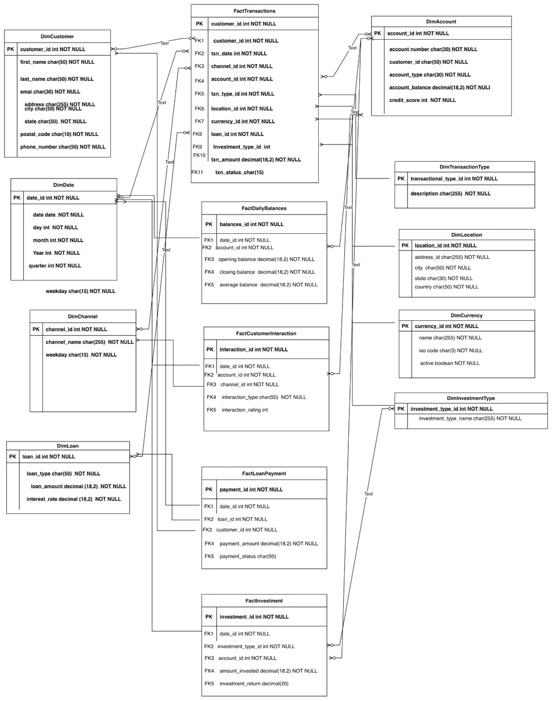

# 🏦 Banking Data Warehouse with Medallion Architecture

[](https://www.python.org/)
[](https://www.getdbt.com/)
[](https://aws.amazon.com/redshift/)
[](LICENSE)

> An end-to-end data warehouse implementation showcasing the Medallion Architecture (Bronze → Silver → Gold) for banking analytics using AWS Redshift, dbt, and Python.

## 📋 Table of Contents
- [Project Overview](#-project-overview)
- [Architecture](#-architecture)
- [Tech Stack](#-tech-stack)
- [Data Model](#-data-model)
- [Project Structure](#-project-structure)
- [Setup & Installation](#-setup--installation)
- [Running the Pipeline](#-running-the-pipeline)
- [Sample Queries & Insights](#-sample-queries--insights)
- [Key Features](#-key-features)
- [Learning Outcomes](#-learning-outcomes)
- [Future Enhancements](#-future-enhancements)

---

## 🎯 Project Overview

This project demonstrates a production-ready data warehouse solution for banking analytics, implementing the **Medallion Architecture** with a **Constellation Schema** to transform raw transactional data into actionable business insights.

### Business Problem
Financial institutions need to analyze:
- Customer transaction patterns and behaviors across multiple channels
- Account balances and trends over time
- Investment portfolio performance and ROI
- Loan approval rates, payment history, and risk assessment
- Customer service interactions and satisfaction
- Cross-process analytics (e.g., "Do high-balance customers invest more?")

### Solution
A scalable, enterprise-grade data warehouse that:
1. **Ingests** synthetic banking data covering 5 business processes
2. **Transforms** data through Bronze → Silver → Gold layers using dbt
3. **Enables** comprehensive business intelligence through a constellation schema with 5 fact tables and 9 conformed dimensions
4. **Supports** both single-process and cross-process analytical queries

### Architecture Highlights
- 🏗️ **Constellation Schema** - Multiple fact tables sharing conformed dimensions
- 📊 **5 Fact Tables** - Transactions, Investments, Loans, Interactions, Balances
- 🔗 **9 Dimension Tables** - Reusable across all business processes
- 🥉🥈🥇 **Medallion Layers** - Bronze (raw) → Silver (cleaned) → Gold (business-ready)
- ☁️ **Cloud-Native** - AWS Redshift, S3, Glue
- 🛠️ **Modern Stack** - dbt for transformations, DBeaver for analytics

---

## 🏗️ Architecture

### High-Level Architecture

```
┌─────────────────┐
│  Python Script  │  Generate synthetic banking data
│   (Faker lib)   │  
└────────┬────────┘
         │
         ▼
┌─────────────────┐
│   AWS S3 Bucket │  Raw CSV files storage
│   (Bronze Layer)│  
└────────┬────────┘
         │
         ▼
┌─────────────────┐
│  AWS Glue       │  Catalog & schema discovery
│  Crawler        │  
└────────┬────────┘
         │
         ▼
┌─────────────────┐
│  AWS Redshift   │  Data Warehouse
│    Cluster      │  
└────────┬────────┘
         │
         ▼
┌─────────────────┐
│   dbt Models    │  Transform data (Silver → Gold)
│ Transformations │  - Staging (Silver)
│                 │  - Marts (Gold)
└────────┬────────┘
         │
         ▼
┌─────────────────┐
│    DBeaver      │  Query & Visualization
│  (SQL Client)   │  Business Analytics
└─────────────────┘
```

### Medallion Architecture Layers

| Layer | Schema | Purpose | Materialization |
|-------|--------|---------|-----------------|
| **🥉 Bronze** | `dev_bronze` | Raw data from S3 (Glue Catalog) | External Tables |
| **🥈 Silver** | `dev_silver` | Cleaned, validated staging tables | Incremental Tables |
| **🥇 Gold** | `dev_gold` | Business-ready dimensional model | Tables (SCD Type 2) |

---

## 🛠️ Tech Stack

### Data Generation
- **Python 3.8+** - Data generation scripts
- **Faker** - Synthetic data creation
- **CSV** - Initial data format

### Cloud Infrastructure
- **AWS S3** - Data lake storage
- **AWS Glue Crawler** - Metadata cataloging
- **AWS Redshift** - Columnar data warehouse

### Transformation & Modeling
- **dbt (Data Build Tool)** - SQL-based transformations
- **Jinja2** - Template logic in dbt models
- **SQL** - Core transformation language

### Analytics & Visualization
- **DBeaver** - SQL client for querying
- **SQL** - Ad-hoc analysis

---

## 📊 Data Model

### Constellation Schema (Galaxy Schema)

This project implements a **Constellation Schema** with **5 fact tables** sharing **9 conformed dimensions**, enabling comprehensive banking analytics across multiple business processes.

#### **Dimension Tables (9)**
```
📁 Dimensions (Silver & Gold Layers)
├── dim_customer            - Customer profile information
├── dim_date                - Date dimension (2020-2024) with quarter, month_name
├── dim_channel             - Transaction channels (Online, Mobile, ATM, In-Store, Phone)
├── dim_account             - Account details, balances, and credit scores
├── dim_location            - Geographic information (city, state, country)
├── dim_currency            - Currency codes (USD, EUR, JPY) with ISO codes
├── dim_transaction_type    - Transaction categories (Deposit, Withdrawal, Transfer, Payment)
├── dim_investment_type     - Investment product types
└── dim_loan                - Loan products (Mortgage, Personal, Auto, Student)
```

#### **Fact Tables (5)**
```
📊 Facts (Silver & Gold Layers)
├── fact_transaction           - Transaction-level detail (10K rows)
│   └── Measures: transaction_amount, txn_status
│   └── Links to: 8+ dimensions
│
├── fact_investment            - Investment performance tracking
│   └── Measures: amount_invested, investment_return
│   └── Links to: DimDate, DimInvestmentType, DimAccount
│
├── fact_loan_payment          - Loan payment history
│   └── Measures: payment_amount, payment_status
│   └── Links to: DimDate, DimLoan, DimCustomer
│
├── fact_customer_interactions - Customer service interactions
│   └── Measures: interaction_type, interaction_rating
│   └── Links to: DimDate, DimAccount, DimChannel
│
└── fact_daily_balances        - Daily account balance snapshots
    └── Measures: opening_balance, closing_balance, average_balance
    └── Links to: DimDate, DimAccount
```

### Entity Relationship Diagram


**Key Features:**
- ✅ **Conformed Dimensions** - DimDate, DimCustomer, DimAccount shared across all facts
- ✅ **Multiple Business Processes** - Transactions, investments, loans, interactions, balances
- ✅ **Bridge Pattern** - DimAccount connects customers to their financial activities
- ✅ **Time Intelligence** - All facts link to DimDate for temporal analysis
- ✅ **Flexible Analytics** - Enables drill-across queries between fact tables

For detailed schema documentation, see [ARCHITECTURE.md](ARCHITECTURE.md)

---

## 📁 Project Structure

```
dbt_redshift_dw/
├── README.md                      # Project documentation
├── main.py                        # Python data generation script
├── dbt_project.yml                # dbt project configuration
├── macros/
│   └── get_custom_schema.sql     # Custom schema naming macro
├── models/
│   ├── silver/                   # Staging layer
│   │   ├── dimensions/
│   │   │   ├── stg_dim_customer.sql
│   │   │   ├── stg_dim_date.sql
│   │   │   ├── stg_dim_account.sql
│   │   │   ├── stg_dim_channel.sql
│   │   │   ├── stg_dim_currency.sql
│   │   │   ├── stg_dim_investment_type.sql
│   │   │   ├── stg_dim_location.sql
│   │   │   ├── stg_dim_loan.sql
│   │   │   └── stg_dim_transaction_type.sql
│   │   └── facts/
│   │       ├── stg_fact_transaction.sql
│   │       ├── stg_fact_investment.sql
│   │       ├── stg_fact_loan.sql
│   │       ├── stg_fact_customer_interactions.sql
│   │       └── stg_fact_daily_balances.sql
│   └── gold/                     # Business layer
│       ├── dimensions/
│       │   ├── dim_customer.sql
│       │   ├── dim_date.sql
│       │   └── ...
│       └── facts/
│           ├── fact_transaction.sql
│           ├── fact_investment.sql
│           └── ...
├── tests/                        # dbt tests
│   ├── bronze/
│   ├── silver/
│   └── gold/
├── seeds/                        # Static reference data
├── snapshots/                    # SCD Type 2 tracking
└── analyses/                     # Ad-hoc analysis queries
```

---

## 🚀 Setup & Installation

### Prerequisites
- Python 3.8+
- AWS Account with Redshift cluster
- dbt installed (`pip install dbt-redshift`)
- AWS CLI configured
- DBeaver or any SQL client

### 1. Clone the Repository
```bash
git clone https://github.com/yourusername/dbt-redshift-banking-dw.git
cd dbt-redshift-banking-dw
```

### 2. Set Up Python Environment
```bash
python -m venv .venv
source .venv/bin/activate  # On Windows: .venv\Scripts\activate
pip install -r requirements.txt
```

**requirements.txt:**
```
faker==20.0.0
boto3==1.28.0
python-dotenv==1.0.0
```

### 3. Generate Synthetic Data
```bash
python main.py
```

This generates CSV files:
- `dim_customers.csv` (100 records)
- `dim_dates.csv` (5 years: 2020-2024)
- `dim_channels.csv` (5 channels)
- `dim_transaction_types.csv` (4 types)
- `dim_locations.csv` (50 locations)
- `dim_currencies.csv` (3 currencies)
- `dim_accounts.csv` (100 accounts)
- `dim_investment_types.csv` (5 types)
- `dim_loans.csv` (50 loans)
- `fact_transactions.csv` (10,000 transactions)
- `fact_investments.csv` (10,000 investments)
- `fact_loans.csv` (10,000 loan applications)
- `fact_customer_interactions.csv` (10,000 interactions)
- `fact_daily_balances.csv` (10,000 balance snapshots)

### 4. Upload to S3
```bash
aws s3 sync . s3://your-bucket-name/banking-data/ --exclude "*" --include "*.csv"
```

### 5. Configure AWS Glue Crawler
1. Navigate to AWS Glue Console
2. Create a new Crawler pointing to your S3 bucket
3. Set target database: `dev_bronze`
4. Run the crawler to catalog all CSV files

### 6. Set Up Redshift
```sql
-- Create schemas
CREATE SCHEMA IF NOT EXISTS dev_bronze;
CREATE SCHEMA IF NOT EXISTS dev_silver;
CREATE SCHEMA IF NOT EXISTS dev_gold;

-- Create external schema for Glue Catalog
CREATE EXTERNAL SCHEMA bronze_external
FROM DATA CATALOG
DATABASE 'dev_bronze'
IAM_ROLE 'arn:aws:iam::YOUR_ACCOUNT_ID:role/RedshiftS3Role'
REGION 'us-east-1';
```

### 7. Configure dbt Profile
Edit `~/.dbt/profiles.yml`:
```yaml
dbt_redshift_dw:
  outputs:
    dev:
      type: redshift
      host: your-cluster.region.redshift.amazonaws.com
      port: 5439
      user: your_username
      password: your_password
      dbname: dev
      schema: dev_gold
      threads: 4
  target: dev
```

### 8. Install dbt Dependencies
```bash
dbt deps
```

---

## ▶️ Running the Pipeline

### Full Pipeline Run
```bash
# Run all models (Silver + Gold layers)
dbt run

# Run with full refresh (rebuild all tables)
dbt run --full-refresh

# Run specific layer
dbt run --select silver.*
dbt run --select gold.*

# Run specific model
dbt run --select stg_dim_customer
```

### Testing
```bash
# Run all tests
dbt test

# Test specific layer
dbt test --select silver.*

# Test specific model
dbt test --select dim_customer
```

### Documentation
```bash
# Generate documentation
dbt docs generate

# Serve documentation locally
dbt docs serve
```

### Typical Workflow
```bash
# 1. Generate fresh data
python main.py

# 2. Upload to S3
aws s3 sync . s3://your-bucket/banking-data/ --include "*.csv"

# 3. Run Glue Crawler
aws glue start-crawler --name banking-data-crawler

# 4. Run dbt transformations
dbt run

# 5. Test data quality
dbt test

# 6. Query in DBeaver
```

---

## 📈 Sample Queries & Insights

### 1. Top 10 Customers by Transaction Volume
```sql
SELECT 
    c.customer_id,
    c.first_name || ' ' || c.last_name AS customer_name,
    COUNT(ft.transaction_id) AS total_transactions,
    SUM(ft.transaction_amount) AS total_amount,
    AVG(ft.transaction_amount) AS avg_transaction
FROM dev_gold.dim_customer c
JOIN dev_gold.dim_account a ON c.customer_id = a.customer_id
JOIN dev_gold.fact_transaction ft ON a.account_id = ft.account_id
WHERE ft.transaction_status = 'Completed'
GROUP BY 1, 2
ORDER BY total_amount DESC
LIMIT 10;
```

### 2. Monthly Transaction Trends by Channel
```sql
SELECT 
    d.year,
    d.month,
    ch.channel_name,
    COUNT(ft.transaction_id) AS transaction_count,
    SUM(ft.transaction_amount) AS total_amount
FROM dev_gold.fact_transaction ft
JOIN dev_gold.dim_date d ON ft.date_id = d.date_id
JOIN dev_gold.dim_channel ch ON ft.channel_id = ch.channel_id
WHERE ft.transaction_status = 'Completed'
GROUP BY 1, 2, 3
ORDER BY 1, 2, 4 DESC;
```

### 3. Investment Performance by Type
```sql
SELECT 
    it.investment_type_name,
    COUNT(fi.investment_id) AS total_investments,
    SUM(fi.investment_amount) AS total_invested,
    SUM(fi.investment_return) AS total_return,
    ROUND(
        (SUM(fi.investment_return) / NULLIF(SUM(fi.investment_amount), 0)) * 100, 
        2
    ) AS roi_percentage
FROM dev_gold.fact_investment fi
JOIN dev_gold.dim_investment_type it ON fi.investment_type_id = it.investment_type_id
GROUP BY 1
ORDER BY roi_percentage DESC;
```

### 4. Loan Approval Rates by Type
```sql
SELECT 
    dl.loan_type,
    COUNT(fl.loan_fact_id) AS total_applications,
    SUM(CASE WHEN fl.loan_status = 'Approved' THEN 1 ELSE 0 END) AS approved,
    SUM(CASE WHEN fl.loan_status = 'Rejected' THEN 1 ELSE 0 END) AS rejected,
    ROUND(
        (SUM(CASE WHEN fl.loan_status = 'Approved' THEN 1 ELSE 0 END)::FLOAT / 
         COUNT(fl.loan_fact_id)) * 100, 
        2
    ) AS approval_rate
FROM dev_gold.fact_loan fl
JOIN dev_gold.dim_loan dl ON fl.loan_id = dl.loan_id
GROUP BY 1
ORDER BY approval_rate DESC;
```

### 5. Customer Balance Trends Over Time
```sql
WITH daily_totals AS (
    SELECT 
        d.date,
        SUM(fdb.closing_balance) AS total_balance,
        AVG(fdb.closing_balance) AS avg_customer_balance,
        COUNT(DISTINCT fdb.account_id) AS active_accounts
    FROM dev_gold.fact_daily_balances fdb
    JOIN dev_gold.dim_date d ON fdb.date_id = d.date_id
    GROUP BY 1
)
SELECT *
FROM daily_totals
ORDER BY date DESC
LIMIT 30;
```

### 6. Geographic Transaction Distribution
```sql
SELECT 
    l.country,
    l.state,
    l.city,
    COUNT(ft.transaction_id) AS transaction_count,
    SUM(ft.transaction_amount) AS total_amount,
    AVG(ft.transaction_amount) AS avg_amount
FROM dev_gold.fact_transaction ft
JOIN dev_gold.dim_location l ON ft.location_id = l.location_id
WHERE ft.transaction_status = 'Completed'
GROUP BY 1, 2, 3
ORDER BY total_amount DESC
LIMIT 20;
```

### 7. **Cross-Process Analysis: Customer Financial Profile** 🌟
**Demonstrates Constellation Schema Power - Joining Multiple Fact Tables**
```sql
-- Comprehensive customer financial behavior across all business processes
WITH customer_transactions AS (
    SELECT 
        a.customer_id,
        COUNT(ft.transaction_id) AS total_transactions,
        SUM(ft.transaction_amount) AS total_transaction_amount
    FROM dev_gold.fact_transaction ft
    JOIN dev_gold.dim_account a ON ft.account_id = a.account_id
    WHERE ft.transaction_status = 'Completed'
    GROUP BY 1
),
customer_investments AS (
    SELECT 
        a.customer_id,
        COUNT(fi.investment_id) AS total_investments,
        SUM(fi.amount_invested) AS total_invested,
        SUM(fi.investment_return) AS total_investment_return
    FROM dev_gold.fact_investment fi
    JOIN dev_gold.dim_account a ON fi.account_id = a.account_id
    GROUP BY 1
),
customer_loans AS (
    SELECT 
        flp.customer_id,
        COUNT(flp.payment_id) AS total_loan_payments,
        SUM(flp.payment_amount) AS total_loan_paid
    FROM dev_gold.fact_loan_payment flp
    WHERE flp.payment_status = 'Approved'
    GROUP BY 1
),
customer_interactions AS (
    SELECT 
        a.customer_id,
        COUNT(fci.interaction_id) AS total_interactions,
        AVG(fci.interaction_rating) AS avg_satisfaction_score
    FROM dev_gold.fact_customer_interaction fci
    JOIN dev_gold.dim_account a ON fci.account_id = a.account_id
    GROUP BY 1
)
SELECT 
    c.customer_id,
    c.first_name || ' ' || c.last_name AS customer_name,
    c.customer_tier,
    c.avg_credit_score,
    COALESCE(ct.total_transactions, 0) AS transactions_count,
    COALESCE(ct.total_transaction_amount, 0) AS transaction_volume,
    COALESCE(ci.total_investments, 0) AS investments_count,
    COALESCE(ci.total_invested, 0) AS investment_amount,
    COALESCE(ci.total_investment_return, 0) AS investment_returns,
    ROUND(COALESCE(ci.total_investment_return / NULLIF(ci.total_invested, 0), 0) * 100, 2) AS roi_percentage,
    COALESCE(cl.total_loan_payments, 0) AS loan_payments_count,
    COALESCE(cl.total_loan_paid, 0) AS total_loan_paid,
    COALESCE(cint.total_interactions, 0) AS interaction_count,
    COALESCE(cint.avg_satisfaction_score, 0) AS satisfaction_score,
    -- Customer health score (weighted composite)
    (
        (COALESCE(ct.total_transactions, 0) * 0.2) +
        (COALESCE(ci.total_investments, 0) * 0.3) +
        (COALESCE(cint.avg_satisfaction_score, 0) * 10) +
        (COALESCE(c.avg_credit_score, 0) / 10)
    ) AS customer_health_score
FROM dev_gold.dim_customer c
LEFT JOIN customer_transactions ct ON c.customer_id = ct.customer_id
LEFT JOIN customer_investments ci ON c.customer_id = ci.customer_id
LEFT JOIN customer_loans cl ON c.customer_id = cl.customer_id
LEFT JOIN customer_interactions cint ON c.customer_id = cint.customer_id
ORDER BY customer_health_score DESC
LIMIT 20;
```

**What This Query Demonstrates:**
- ✅ **Constellation Schema Benefits** - Seamlessly joins 4 different fact tables
- ✅ **Conformed Dimensions** - DimCustomer and DimAccount link all business processes
- ✅ **Comprehensive Analytics** - 360° customer view across transactions, investments, loans, interactions
- ✅ **Calculated Metrics** - ROI percentage, customer health score
- ✅ **Business Value** - Identify high-value customers for targeted marketing

---

## ✨ Key Features

### 1. Constellation Schema (Galaxy Schema)
- **Multiple Fact Tables**: 5 fact tables covering different business processes
- **Conformed Dimensions**: 9 shared dimensions ensuring consistency
- **Cross-Process Analytics**: Ability to analyze relationships between transactions, investments, loans, and interactions
- **Scalable Design**: Easy to add new fact tables without dimension duplication
- **Bridge Pattern**: DimAccount connects customers to all financial activities

### 2. Medallion Architecture Implementation
- **Bronze Layer**: Raw data from S3 via Glue Catalog (14 external tables)
- **Silver Layer**: Cleaned, validated, incremental staging tables
- **Gold Layer**: Business-ready dimensional models with enriched metrics

### 3. Data Quality & Testing
- Primary key uniqueness tests
- Not-null constraints on critical fields
- Referential integrity checks
- Custom dbt tests for business logic

### 3. Incremental Loading
```sql
-- Example: Incremental transaction loading
{{ config(
    materialized='incremental',
    unique_key='transaction_id',
    on_schema_change='fail'
) }}

SELECT *
FROM {{ source('bronze', 'fact_transactions') }}

WHERE date_id > (SELECT MAX(date_id) FROM {{ this }})

```

### 4. Custom Schema Management
```sql
-- macros/get_custom_schema.sql

    
    
        {{ default_schema }}
    
        {{ custom_schema_name | trim }}
    

```

### 5. Performance Optimization
- Redshift distribution keys on high-cardinality columns
- Sort keys on date columns for time-series queries
- Compression encoding for columnar storage
- Incremental models to reduce processing time

---

## 🎓 Learning Outcomes

This project demonstrates proficiency in:

### Data Engineering
- ✅ End-to-end data pipeline development
- ✅ Medallion architecture implementation
- ✅ Cloud data warehouse design (AWS Redshift)
- ✅ ETL/ELT best practices

### dbt Mastery
- ✅ dbt models (staging, intermediate, marts)
- ✅ Incremental loading strategies
- ✅ Custom macros and Jinja templating
- ✅ Data testing and documentation

### AWS Ecosystem
- ✅ S3 for data lake storage
- ✅ Glue Crawler for metadata management
- ✅ Redshift cluster configuration
- ✅ IAM roles and permissions

### SQL & Analytics
- ✅ Complex SQL queries and window functions
- ✅ Star schema dimensional modeling
- ✅ Performance optimization techniques
- ✅ Business intelligence query patterns

### Software Engineering
- ✅ Version control with Git
- ✅ Python scripting for data generation
- ✅ Documentation and README best practices
- ✅ Code modularity and reusability

---

## 🔮 Future Enhancements

### Technical Improvements
- [ ] Implement CI/CD pipeline (GitHub Actions)
- [ ] Add Airflow for orchestration
- [ ] Implement data lineage tracking
- [ ] Add real-time streaming with Kafka/Kinesis
- [ ] Implement data quality monitoring (Great Expectations)
- [ ] Add dbt snapshot models for SCD Type 2

### Analytics Enhancements
- [ ] Build Tableau/Power BI dashboards
- [ ] Implement customer segmentation (RFM analysis)
- [ ] Add predictive models (loan default, churn)
- [ ] Create anomaly detection for fraud
- [ ] Build customer lifetime value models

### Infrastructure Upgrades
- [ ] Terraform/CloudFormation for IaC
- [ ] Implement data catalog (AWS DataZone/DataHub)
- [ ] Add data masking for PII compliance
- [ ] Implement disaster recovery strategy
- [ ] Add cost optimization (spot instances, reserved capacity)

---

## 📝 License

This project is licensed under the MIT License - see the [LICENSE](LICENSE) file for details.

---

## 🤝 Contributing

Contributions, issues, and feature requests are welcome! Feel free to check the [issues page](https://github.com/yourusername/dbt-redshift-banking-dw/issues).

---

## 👤 Author

**Nifesimi Ademoye**

- LinkedIn: [Your LinkedIn](https://linkedin.com/in/yourprofile)
- GitHub: [@yourusername](https://github.com/yourusername)
- Portfolio: [yourportfolio.com](https://yourportfolio.com)

---

## 🙏 Acknowledgments

- AWS for cloud infrastructure
- dbt Labs for the transformation framework
- Faker library for synthetic data generation
- The data engineering community for best practices

---

## 📚 References

- [dbt Documentation](https://docs.getdbt.com/)
- [AWS Redshift Best Practices](https://docs.aws.amazon.com/redshift/latest/dg/best-practices.html)
- [Medallion Architecture](https://www.databricks.com/glossary/medallion-architecture)
- [Dimensional Modeling (Kimball)](https://www.kimballgroup.com/data-warehouse-business-intelligence-resources/kimball-techniques/dimensional-modeling-techniques/)

---

⭐ **If you found this project helpful, please consider giving it a star!** ⭐